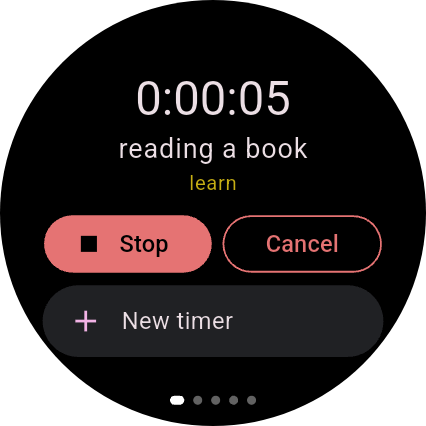
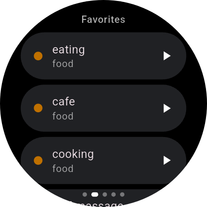
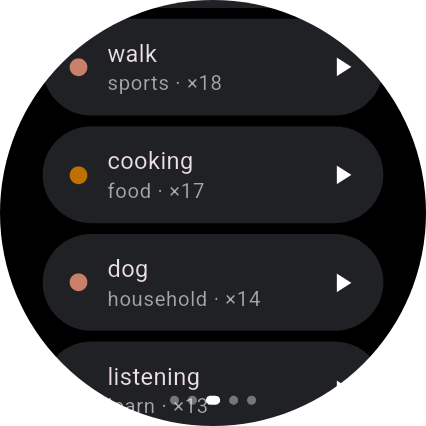
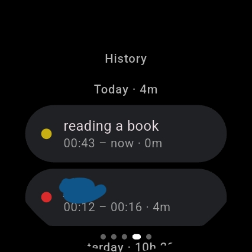
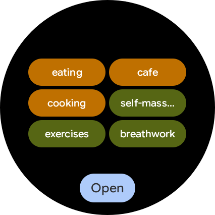
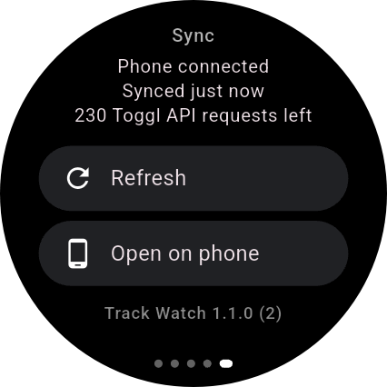
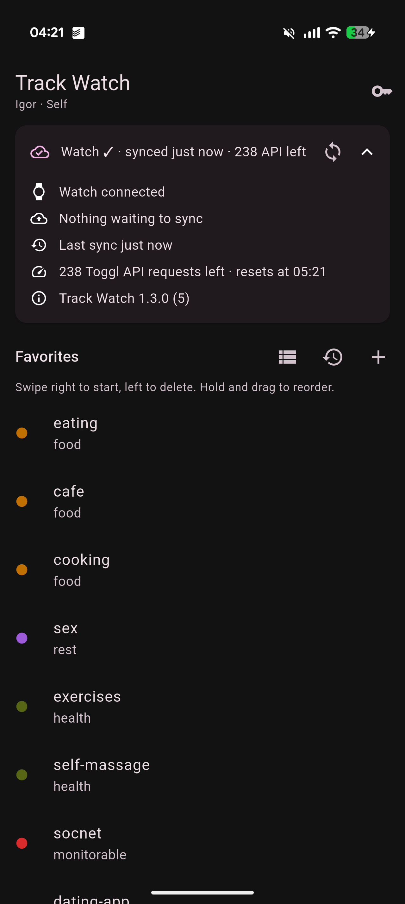

# Track Watch

[](https://github.com/ihoru/toggl-track-watch/actions/workflows/build.yml)
[](https://github.com/ihoru/toggl-track-watch/releases/latest)
[](LICENSE)

**An unofficial [Toggl Track](https://toggl.com/track/) timer for Wear OS**, with a companion Android
phone app. Start, stop and edit your time entries from your wrist.

> Track Watch is not affiliated with, endorsed or sponsored by Toggl. Toggl and Toggl Track are
> trademarks of their respective owner.

<p>
  
  
  
  
  
  
</p>


## Features

**Watch:** five pages you swipe between.
- **Now:** the running timer with Stop and Cancel, **Edit start time** (turn the crown or tap
  ±5 / ±15 min), Continue the last entry, and New timer (description by voice or keyboard, project
  from a list).
- **Favorites.**
- **Frequent:** your most-tracked timers of the last 30 days.
- **History:** the last 7 days with daily totals. Continue, edit or delete entries.
- **Sync:** status, API requests left, Refresh, Open on phone and **Settings**.
- Plus a **tile** (running timer with Stop, up to six timers in two columns), a **complication** with
  the elapsed time, the running timer on your watch face, and a dimmed ambient screen.

**Phone:** paste your Toggl API token once and manage favorites.
- Swipe right on a favorite to start it (through the Toggl app if installed), swipe left to delete it.
- Compact list view, sync status and Toggl API quota.
- Token and favorites are backed up with Google Block Store and restored after a reinstall.

**Offline:** nothing is lost. The watch queues actions until the phone is reachable, and the phone
queues them until Toggl accepts them (no network, API quota reached, server errors). Offline starts
and stops keep the time you tapped.

## Install

Download **track-watch-phone-…apk** and **track-watch-wear-…apk** from the
[latest release](https://github.com/ihoru/toggl-track-watch/releases/latest). Always install both
from the same release: the apps only connect when they're signed with the same key.

- **Phone:** open the APK and allow installing from your browser or file manager.
- **Watch:** Wear OS has no file manager, so use adb over Wi-Fi. From a phone, use an adb app such as
  Bugjaeger. From a computer:
  ```sh
  # On the watch: Settings → System → About → tap Build number 7× → Developer options →
  # ADB debugging + Wireless debugging → Pair new device.
  adb pair <watch-ip>:<pair-port>          # enter the pairing code
  adb connect <watch-ip>:<port>
  adb -s <watch-ip>:<port> install track-watch-wear-<version>.apk
  ```

Then:
1. Open **Track Watch** on the phone and paste your API token (Toggl Track → Profile → API Token).
2. Add favorites.
3. Open Track Watch on the watch and allow notifications.
4. Optional: add the **Track Watch** tile and the **Toggl timer** complication.

Updates install over the previous version. The installed version is shown in the phone's Sync
details and on the watch's Sync page.

## Privacy

Your token stays encrypted on your phone. The app talks only to Toggl's API, and has no analytics
and no servers of its own. See the [privacy policy](docs/PRIVACY.md).

## Build from source

Requires Flutter 3.47+ and the Android SDK.

```sh
flutter pub get
flutter test
flutter build apk --release --flavor phone -t lib/main_phone.dart --split-per-abi --target-platform android-arm64
flutter build apk --release --flavor wear  -t lib/main_wear.dart  --split-per-abi --target-platform android-arm64
```

The APKs are written to `build/app/outputs/flutter-apk/app-arm64-v8a-{phone,wear}-release.apk`.
CI (`.github/workflows/build.yml`) runs the tests, builds both apps and launches them in phone and
Wear OS emulators on every push and pull request.

### Signing

The phone and watch apps only see each other if **both are signed with the same key**. Local builds
use your debug key, which works as long as you build both on the same machine. For a stable key,
create `android/key.properties` (git-ignored):

```properties
storeFile=/absolute/path/to/trackwatch.jks
storePassword=...
keyAlias=trackwatch
keyPassword=...
```

CI reads the same values from the repository secrets `TRACKWATCH_KEYSTORE_BASE64`
(`base64 -w0 trackwatch.jks`), `TRACKWATCH_KEYSTORE_PASSWORD`, `TRACKWATCH_KEY_ALIAS` and
`TRACKWATCH_KEY_PASSWORD`.

### Releases

Bump `version:` in `pubspec.yaml`, add the version's section to [CHANGELOG.md](CHANGELOG.md), merge
to `main` and push a tag `v<version>`. The release workflow publishes a GitHub Release with the
APKs and, once configured, uploads to Google Play. See [docs/PUBLISHING.md](docs/PUBLISHING.md).

## Project layout

```
lib/
  main_phone.dart, main_wear.dart   entry points (lib/main.dart = phone)
  src/                              shared Dart models, formatting, theme, links
  phone/                            phone settings UI + channel bridge
  wear/                             watch UI + channel bridge
android/app/src/
  main/kotlin/.../shared/           shared Kotlin: data model, optimistic reducer, queue logic
  phone/kotlin/                     Toggl API client, token store, queue, sync worker, Block Store backup
  wear/kotlin/                      watch store, tile, complication, ongoing activity, settings
  test/kotlin/                      JVM unit tests for the shared Kotlin logic
```

One Flutter project builds both apps with the `phone` and `wear` flavors. They share the application
id `su.iho.trackwatch`, which the Wear OS Data Layer requires. Design notes: [docs/SPEC.md](docs/SPEC.md).

## How it works

- The phone refreshes from Toggl when the watch app or tile opens, after each change, and every
  15 minutes. Projects are refreshed at most once an hour and frequent timers once a day, to stay
  within Toggl's API quotas.
- If Toggl reports the API quota as exhausted (HTTP 402), the phone waits until it resets and then
  sends the queued changes.
- Starting a favorite from the phone opens the official Toggl app through its
  `toggl://tracker/timeEntry/start?...` link. If no app handles it, Track Watch starts the timer
  itself.
- On the watch, swipe left and right between pages. On the first page, a right swipe closes the app;
  on detail screens it goes back.
- Wear OS tiles can't scroll, so the tile shows as many timers as fit: favorites first, then frequent.

## Contributing

Issues and pull requests are welcome. See [CONTRIBUTING.md](CONTRIBUTING.md). Report security
problems privately (see [SECURITY.md](SECURITY.md)).

## License

[MIT](LICENSE)
